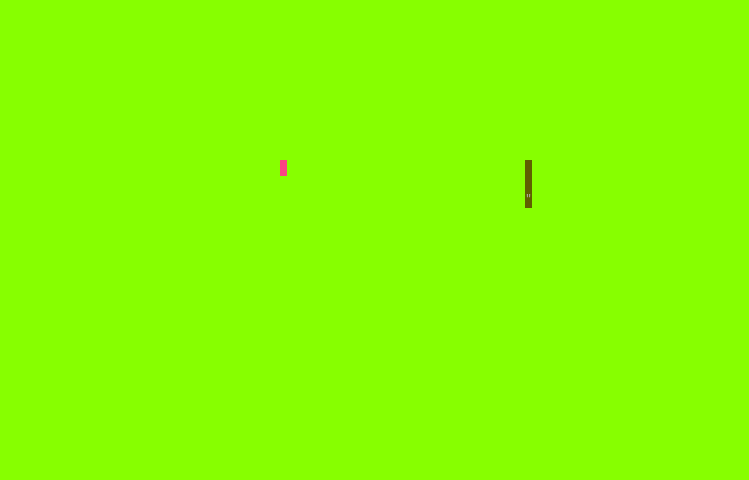

# text-snake

<p align="center">
  
</p>

text-snake is a simple console-based snake game in Python. It's designed to be playable on a broad range of terminals, including Windows, Linux, and MacOS. 
The game is built using the `blessed` library, which provides a high-level interface for handling terminal graphics and input.

## Features

* **Cross‑platform** – tested on Windows and Ubuntu
* **Fullscreen** – runs in a terminal window, no GUI required
* **Adjustable speed** – FPS from slow to frantic
* **High‑scores** – top 10 stored locally

## Installation

PyPI
```bash
pip install text-snake
```

Pipx
```bash
pipx git+https://github.com/Ninja00Shadow/text_snake.git
```

You can also clone the repository and run the game directly from the source code. Make sure you have Python 3.x installed.

```bash

```

## Quick start
```bash
snake                 # start the game
snake --speed 20      # slower snake (20 FPS)
snake scores          # print the current high‑score table
```

## Controls
- `Arrow keys` to control the snake
- `q` to quit the game

## More config options
```bash
snake --help
```

