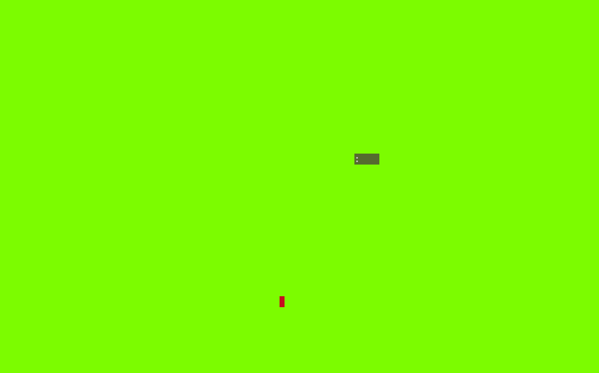

# text-snake

<p align="center">
  
</p>

text-snake is a simple console-based snake game in Python. It's designed to be playable on a broad range of terminals, including Windows, Linux, and MacOS. 
The game is built using the `blessed` library, which provides a high-level interface for handling terminal graphics and input.

## Features

* **Cross‑platform** – tested on Windows and Ubuntu
* **Works everywhere** – runs in a terminal window, no GUI required
* **Adjustable** – change the speed, length, and other parameters
* **High‑scores** – top 10 stored locally

## Installation

Installation by pip
```bash
git clone https://github.com/Ninja00Shadow/text_snake.git
cd text_snake
pip install .
```

Pipx
```bash
pipx install git+https://github.com/Ninja00Shadow/text_snake.git
```

## Quick start
```bash
snake                 # start the game
snake scores          # print the current high‑score table
snake defaults        # change the default values (speed, length, etc.)
```

## Controls
- `WASD keys` to control the snake
- `q` to quit the game

## More config options
```bash
snake --help
```

